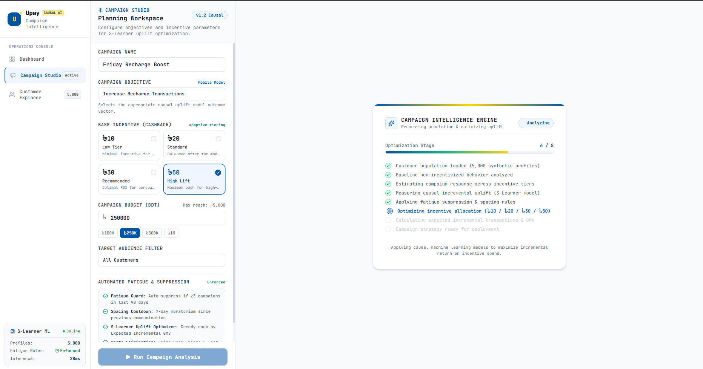
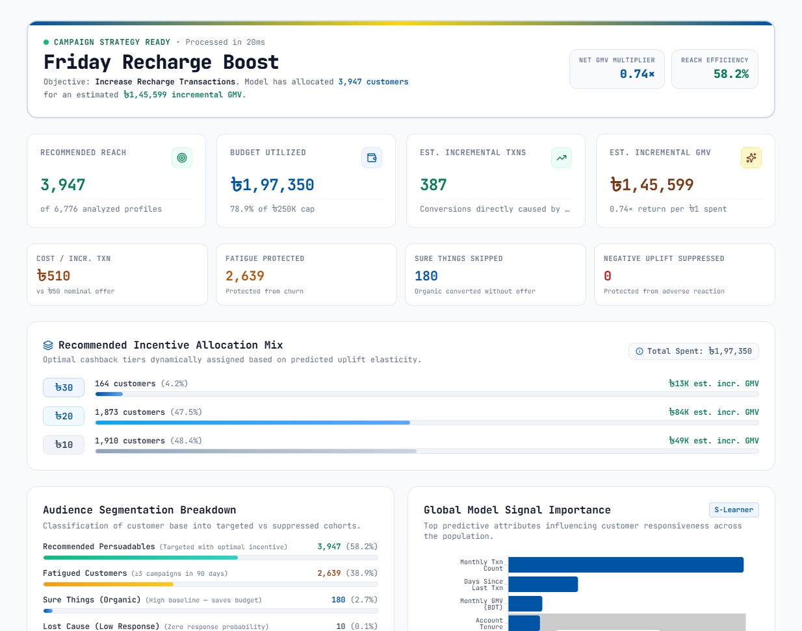
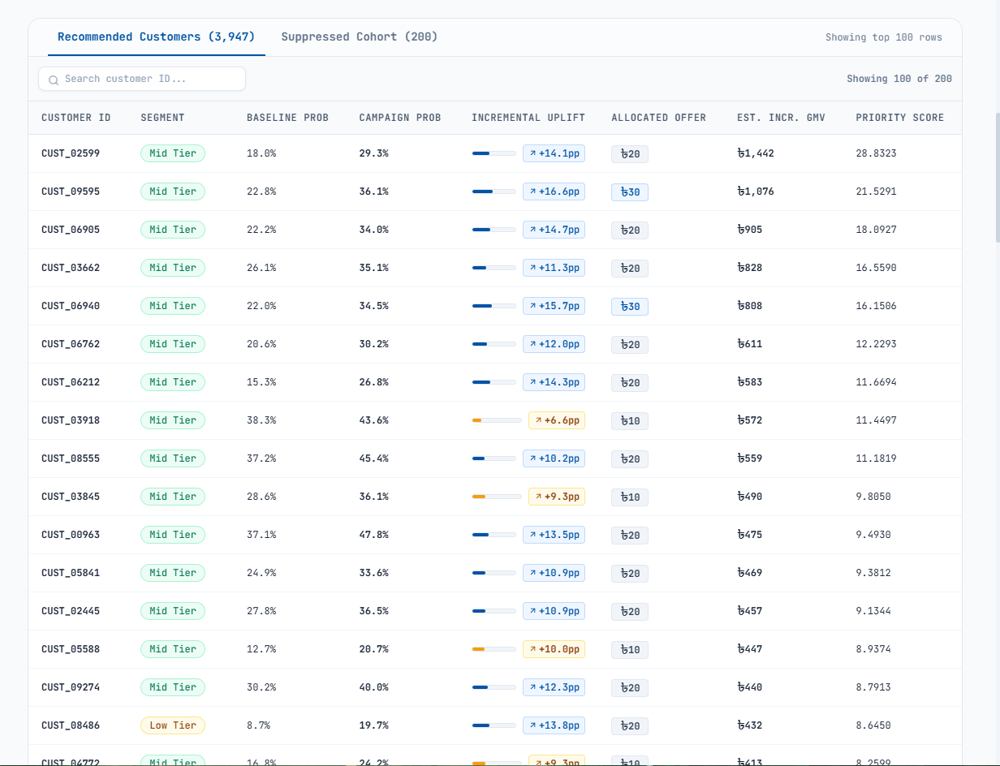
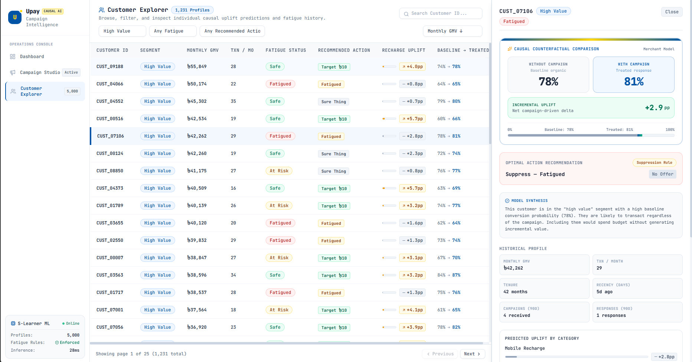

# Upay Campaign Intelligence

<p align="center">
  <strong>AI-Powered Causal Uplift & Audience Optimization Engine for Mobile Financial Services</strong>
</p>

<p align="center">
  
  
  
  
  
  
  
  
</p>

**Live Link** : https://upay-campaign-intelligence-frontend.vercel.app/
---

## 1. Project Overview

**Upay Campaign Intelligence** is an end-to-end campaign optimization and audience intelligence platform designed for Mobile Financial Services (MFS) growth and campaign managers.

### The Campaign Targeting Problem in MFS

Traditional MFS marketing campaigns typically rely on **propensity models** or simple rule-based heuristics (e.g., targeting the top 10% highest-spending users or dormant users). While intuitive, propensity models answer the question:

> *"Which customers are most likely to make a transaction?"*

This question leads to substantial budget waste. In financial services:
- **"Sure Things" (organic transactors)**: Customers with high transaction frequency will recharge their phones or pay merchant bills regardless of an incentive. Offering them a ৳30 cashback wastes marketing spend without driving incremental volume.
- **"Lost Causes"**: Inactive or disengaged users who will not transact regardless of a small promotion.
- **"Sleeping Dogs / Fatigue Risk"**: Customers who may react negatively to excessive SMS or app notifications, increasing opt-outs or app uninstalls.

### The Causal Uplift Approach

Upay Campaign Intelligence reframes campaign targeting around **causal uplift modeling**:

> *"Which customers will transact **because** they received this specific campaign and incentive?"*

By estimating the **Incremental Conversion Probability (Uplift)**—the mathematical difference between a customer's probability of converting under promotional treatment ($P(\text{convert} \mid T=1)$) versus control without intervention ($P(\text{convert} \mid T=0)$)—the engine isolates true **"Persuadables"**.

### Purpose of the Project

The purpose of this project is to provide Upay campaign managers with a production-grade decision console to:
1. **Maximize Incremental Gross Merchandise Value (GMV)** and incremental transactions under fixed budget constraints.
2. **Eliminate wasted budget** on organic transactors ("Sure Things") and low-responsiveness cohorts.
3. **Prevent customer fatigue** through automated communication frequency moratoriums and fatigue risk filters.
4. **Dynamically tier incentives** (৳10, ৳20, ৳30, ৳50) based on customer price elasticity and uplift potential rather than uniform discounting.

---

## 2. Visual Walkthrough & Screenshots

| Campaign Studio & Execution Sequence | Strategy Report & Incentive Allocation |
|:---:|:---:|
|  |  |
| *Configuring objective, budget cap, and real-time 8-stage causal optimization pipeline.* | *Strategy report with GMV multiplier, budget utilization, tiered cashback breakdown, and feature signals.* |

| Audience Recommendation & Priority Scoring | Customer Explorer & Causal Counterfactual Panel |
|:---:|:---:|
|  |  |
| *Audience audit table displaying baseline vs. campaign probabilities, uplift pp, and priority rank.* | *Individual counterfactual inspector comparing organic baseline to treated response with driver analysis.* |

---

## 3. Core Features

### 1. Operations Console & Dashboard
- **Population Telemetry**: Real-time overview of 10,000 synthetic MFS customer profiles categorized across four core segments: High Value, Mid Tier, Low Tier, and Dormant.
- **Campaign Opportunity Identification**: Automated scanner identifying addressable active customers exhibiting high responsiveness ($\ge 10\text{pp}$ uplift) across service channels.
- **Customer Availability & Fatigue Monitoring**: Immediate visibility into Fatigue-Safe, At-Risk, and Suppressed cohorts.
- **Cross-Category Responsiveness**: Interactive comparison of causal responsiveness across Recharge, Merchant Payment, P2P, and Bill Pay channels.
- **Uplift Distribution Spectrum**: Visual histogram illustrating population distribution across incremental conversion buckets.

### 2. Campaign Studio & Planning Workspace
- **Objective-Driven Targeting**: Select campaign objectives (Increase Recharge Transactions, Increase GMV, Reactivate Dormant Customers, Boost Merchant Payments, Increase P2P Transfers, Bill Pay Expansion) with automatic model vector mapping.
- **Budget & Incentive Controls**: Set custom budget caps (৳100K, ৳250K, ৳500K, ৳1M) and select baseline incentive levels (৳10, ৳20, ৳30, ৳50).
- **Automated Moratorium Guard**: Built-in toggle enforcing communication limits ($\ge 3$ campaigns in 90 days) and a 7-day spacing cooldown between outbound campaigns.
- **Real-Time Multi-Stage Analysis Pipeline**: Simulated multi-stage optimization pipeline illustrating population loading, baseline profiling, S-Learner scoring, fatigue pruning, and dynamic incentive optimization.

### 3. Campaign Strategy Report & Impact Analytics
- **Return Multiplier & Efficiency**: Calculates expected Net GMV Multiplier ($\text{Incremental GMV} / \text{Campaign Cost}$) and Reach Efficiency percentage.
- **Incremental Volume Estimation**: Model-driven forecast of total incremental transactions directly created by the campaign.
- **Incremental GMV Projection**: Projected gross merchandise value generated exclusively from persuaded customers.
- **Adaptive Incentive Allocation Mix**: Dynamically segments target audience into customized incentive tiers (৳50 high lift, ৳30 recommended, ৳20 standard, ৳10 low-tier push) to optimize return on investment.
- **Cohort Suppression Audit**: Clear categorization of non-targeted customers:
  - *Fatigue Protected*: Prevented customer burnout.
  - *Sure Things Skipped*: Organic transactors excluded to preserve marketing budget.
  - *Negative Uplift / Do Not Disturb*: Protected from potential adverse brand response.
  - *Lost Cause*: Excluded due to near-zero expected conversion delta.

### 4. Customer Explorer & Counterfactual Profiler
- **Searchable Customer Directory**: Paginated, filterable database of all 10,000 customer accounts with segment, GMV, monthly transaction count, and fatigue indicators.
- **Action Recommendation Tags**: Instant classification per customer (`Target ৳30`, `Target ৳10`, `Sure Thing`, `Fatigued`, `DND`).
- **Individual Counterfactual Inspector**: Slide-out audit panel displaying:
  - Baseline organic probability without intervention ($P(Y=1 \mid T=0)$).
  - Treated response probability with intervention ($P(Y=1 \mid T=1)$).
  - Exact incremental uplift delta in percentage points ($\text{pp}$).
  - Top individual feature drivers explaining why the model made the recommendation.
  - Historical behavioral profile and category-level affinities.

---

## 4. AI / ML — How It Works

```
┌─────────────────────────┐     ┌─────────────────────────┐     ┌─────────────────────────┐
│  Customer Population    │ ──> │   Feature Engineering   │ ──> │ S-Learner Uplift Model  │
│  10,000 MFS Profiles    │     │  Tenure, GMV, Recency,  │     │ GradientBoostingClassifier│
│  Synthetic Behavior     │     │  Affinity, Fatigue Rate │     │ P(Y|X,T=1) - P(Y|X,T=0) │
└─────────────────────────┘     └─────────────────────────┘     └───────────┬─────────────┘
                                                                            │
┌─────────────────────────┐     ┌─────────────────────────┐                 │
│ Campaign Strategy Ready │ <── │ Greedy Budget Optimizer │ <───────────────┘
│ Incr. GMV + Allocation  │     │ Rank: Uplift × GMV/Cost │
│ Tiered Incentives (৳)   │     │ Enforce Fatigue Guards  │
└─────────────────────────┘     └─────────────────────────┘
```

### The S-Learner Causal Architecture

The system utilizes an **S-Learner (Single-Learner) Causal Uplift Model** powered by a `GradientBoostingClassifier` trained on historical treatment and control campaign interactions:

1. **Feature Vector ($X_i$)**: Encodes customer transaction habits, tenure, average GMV, recency, category affinities (Recharge, Merchant, P2P, Bill), and past communication fatigue metrics.
2. **Treatment Indicator ($T$)**: Binary indicator representing promotional intervention ($T=1$ with cashback incentive, $T=0$ without incentive).
3. **Outcome ($Y$)**: Binary conversion outcome (transaction completed during campaign window).
4. **Uplift Calculation**:
   $$\tau(X_i) = P(Y=1 \mid X_i, T=1, \text{offer}) - P(Y=1 \mid X_i, T=0)$$

### Customer Quadrant Classification

The model categorizes every customer into one of four behavioral quadrants:

| Quadrant | Behavior Without Offer | Behavior With Offer | Causal Delta ($\tau$) | Optimal Action |
|---|---|---|---|---|
| **Persuadables** | Unlikely to transact | Likely to transact | **Positive ($\tau > 0$)** | **Target with optimal incentive** |
| **Sure Things** | Highly likely to transact | Highly likely to transact | **Zero / Low ($\tau \approx 0$)** | **Suppress (Save budget)** |
| **Lost Causes** | Unlikely to transact | Unlikely to transact | **Zero / Low ($\tau \approx 0$)** | **Suppress (Avoid waste)** |
| **Do Not Disturb** | Moderate/High activity | Reduced activity | **Negative ($\tau < 0$)** | **Suppress (Protect retention)** |

### Suppression & Fatigue Guard Logic

Before budget allocation, candidates pass through rule-based fatigue and suppression guards:
- **Fatigue Rule**: Customers receiving $\ge 3$ campaigns within the last 90 days are automatically suppressed (`suppressed_fatigue`).
- **Spacing Cooldown**: Minimum 7-day moratorium enforced since the previous campaign contact.
- **Sure-Thing Suppression**: Customers with organic baseline conversion $> 65\%$ and incremental uplift $< 3\text{pp}$ are withheld from incentive targeting.

### Greedy ROI Budget Optimizer

Given a fixed campaign budget $B$ and base incentive cost $C$, customers are ranked by a **Priority Score**:

$$\text{Priority Score}_i = \frac{\tau(X_i) \times \text{Avg Transaction Value}_i}{C_i}$$

The engine greedily allocates budget down the ranked list until the budget ceiling is satisfied, ensuring each taka spent maximizes expected incremental GMV.

### Adaptive Incentive Tiering

Rather than offering a static incentive, customers selected by the optimizer receive dynamic cashback amounts based on their uplift elasticity:
- **৳50 High Push**: Assigned to high-potential persuadables ($\tau \ge 25\text{pp}$).
- **৳30 Recommended**: Assigned to moderate-to-high persuadables ($15\text{pp} \le \tau < 25\text{pp}$).
- **৳20 Standard**: Assigned to standard persuadables ($10\text{pp} \le \tau < 15\text{pp}$).
- **৳10 Maintenance**: Assigned to low-tier marginal responders ($\tau < 10\text{pp}$).

> **Notice on Synthetic Data & Simulation Scope:** All customer records, transaction histories, and campaign responses in this prototype are generated synthetically using realistic statistical distributions and behavioral rules. Model outputs, incremental metrics, and GMV multipliers are simulated approximations designed to demonstrate causal ML workflows in a hackathon setting.

---

## 5. Technology Stack

<p>
  
  
  
  
  
  
  
  
  
  
  
</p>

### Technology Breakdown

| Layer | Technology | Version / Specification | Role in Upay Campaign Intelligence |
|---|---|---|---|
| **Frontend Framework** | **React** | 19.2.8 | Single-page application rendering, reactive state management |
| **Build Tool** | **Vite** | 8.3.0 | Ultra-fast HMR and production bundle optimization |
| **Language** | **TypeScript** | 6.0.2 | End-to-end type safety across API contracts and campaign objects |
| **Styling** | **Tailwind CSS** | 3.4.19 | Custom design system using Upay brand colors (`#0054A6`, `#FFD600`) |
| **Typography** | **JetBrains Mono** | Google Fonts | High-readability technical font for tabular financial metrics |
| **UI Primitives** | **Radix UI** | Dialog, Tabs, Tooltip, Select | Accessible, unstyled UI primitives |
| **Animations** | **Framer Motion** | 14.0.0 | Fluid transitions, animated counters (`NumberTicker`), and modal fades |
| **Data Visualization** | **Recharts** | 3.10.1 | Uplift distribution histograms and channel lift charts |
| **Icons** | **Lucide React** | 1.50.0 | Clean contextual interface icons |
| **Backend Runtime** | **Node.js** | 18.x / 20.x | Lightweight REST API server |
| **Web Framework** | **Express** | 4.19.2 | Routing, JSON serialization, and campaign optimization endpoints |
| **CORS Middleware** | **cors** | 2.8.5 | Cross-Origin Resource Sharing configuration |
| **Machine Learning** | **Scikit-Learn** | 1.4.0+ | `GradientBoostingClassifier`, calibration, and AUC evaluation |
| **Data Processing** | **NumPy & Pandas** | 1.24+ / 2.0+ | Data generation, feature engineering, and matrix operations |
| **Hosting Platform** | **Vercel** | Multi-Project Configuration | Serverless deployment for frontend and Node.js backend |

---

## 6. Requirements & Prerequisites

To run Upay Campaign Intelligence locally, ensure you have the following installed:

| Requirement | Minimum Version | Recommended Version | Purpose |
|---|---|---|---|
| **Node.js** | 18.0.0 | 20.x LTS | Backend Express runtime and frontend Vite dev server |
| **npm** | 9.0.0 | 10.x | Package management for frontend and backend dependencies |
| **Python** *(Optional)* | 3.9.0 | 3.11.x | Only required if re-running data generation and model retraining |
| **Git** | 2.30.0+ | Latest | Version control and cloning the repository |

> **Note**: Pre-computed data artifacts (`customers.json`, `uplift_scores.json`, `model_meta.json`) are committed in the repository's `data/` folder. Running Python is **not required** to immediately start and test the backend and frontend.

---

## 7. Installation & Setup

Follow these step-by-step instructions to get the application running from a fresh clone.

### Step 1: Clone the Repository

```bash
git clone https://github.com/Riad-Zz/Upay_Campaign_Intelligence.git
cd Upay_Campaign_Intelligence
```

### Step 2: Set Up and Start the Backend

Open a terminal window:

```bash
cd backend
npm install
npm start
```

The backend API will start on **`http://localhost:3001`**.

You can verify the backend is running by opening `http://localhost:3001/api/health` in your browser.

### Step 3: Set Up and Start the Frontend

Open a second terminal window:

```bash
cd frontend
npm install
npm run dev
```

The frontend application will start on **`http://localhost:5173`**.

Open your browser and navigate to **`http://localhost:5173`** to use the application.

---

### Step 4 (Optional): Re-running the Python ML Pipeline

If you wish to regenerate the synthetic customer population and re-train the S-Learner uplift model:

```bash
cd ml
python -m venv venv

# On Windows:
venv\Scripts\activate
# On macOS/Linux:
source venv/bin/activate

pip install -r requirements.txt

# 1. Generate synthetic customers and historical campaign logs
python generate_data.py

# 2. Train S-Learner, compute causal uplift, and export JSON artifacts
python train_model.py
```

This will refresh `data/customers.json`, `data/uplift_scores.json`, and `data/model_meta.json`.

---

## 8. Environment Variables

The application uses standard environment variables to support both local development and cloud deployments.

### Frontend (`frontend/.env`)

| Variable Name | Required | Default (Local) | Production Example | Description |
|---|---|---|---|---|
| `VITE_API_URL` | No | `http://localhost:3001` | `https://upay-campaign-api.vercel.app` | Base URL of the backend API without trailing slash or `/api` |

A template is provided in `frontend/.env.example`:

```env
# Local development:
VITE_API_URL=http://localhost:3001

# Production (replace with your deployed backend URL):
# VITE_API_URL=https://your-backend.vercel.app
```

### Backend (`backend`)

| Variable Name | Required | Default | Description |
|---|---|---|---|
| `PORT` | No | `3001` | Port on which the Express server listens (auto-configured by Vercel in production) |
| `ALLOWED_ORIGIN` | No | `*` (All origins) | Restricts CORS requests to your frontend domain in production |

---

## 9. Run & Build Commands

### Development Mode

| Service | Directory | Command | Description |
|---|---|---|---|
| **Backend API** | `backend/` | `npm start` | Starts Express server on `http://localhost:3001` |
| **Backend (Dev)** | `backend/` | `npm run dev` | Starts server with `nodemon` auto-reloading |
| **Frontend UI** | `frontend/` | `npm run dev` | Starts Vite dev server on `http://localhost:5173` |

### Production Build

| Service | Directory | Command | Output Destination |
|---|---|---|---|
| **Frontend Build** | `frontend/` | `npm run build` | Compiles TypeScript and builds production assets into `frontend/dist/` |
| **Frontend Preview** | `frontend/` | `npm run preview` | Locally previews the compiled production build |

---

## 10. Live Deployment Status

- **Current Prototype Status**: The application is configured and validated for local execution (`http://localhost:5173` frontend and `http://localhost:3001` backend).
- **Cloud Deployment Ready**: The repository includes complete deployment on (
    Frontent : `https://upay-campaign-intelligence-frontend.vercel.app/` and 
    Backend : `https://upay-campaign-intelligence-backend.vercel.app/`)  **Vercel**.
- Detailed cloud deployment instructions are documented in [hosting.md](hosting.md).

---

## 11. Testing & Verification Walkthrough

The project is structured as an interactive prototype designed for live verification by hackathon judges. Follow this walkthrough to test the core features end-to-end:

1. **Verify Backend Health**: Navigate to `http://localhost:3001/api/health` and verify `{"status":"ok"}` is returned.
2. **Launch Dashboard**: Open `http://localhost:5173`.
3. **Inspect Population Telemetry**: Check the Campaign Opportunity hero card, active audience count, and customer segment breakdown.
4. **Review Cross-Channel Lift**: Inspect the channel comparison bars comparing Mobile Recharge, Merchant, P2P, and Bill Pay responsiveness.
5. **Open Campaign Studio**: Click on **Campaign Studio** in the left sidebar navigation.
6. **Configure Campaign Objective**: Set Campaign Name to `Friday Recharge Boost` and select the objective `Increase Recharge Transactions`.
7. **Select Incentive & Budget**: Choose a base incentive of `৳30` (or `৳50`) and set the budget to `৳250,000`.
8. **Verify Fatigue Settings**: Confirm the automated fatigue guard indicators show active enforcement.
9. **Run Campaign Analysis**: Click **Run Campaign Analysis**. Observe the real-time 8-stage progress tracker.
10. **Analyze Strategy Report**: Review the generated results:
    - Net GMV Multiplier (e.g. `0.74x`–`1.2x`).
    - Budget utilization and recommended reach.
    - Expected incremental transactions and incremental GMV.
    - Suppression counters (Fatigue Protected, Sure Things Skipped, Negative Uplift Suppressed).
11. **Inspect Incentive Mix**: Review the dynamic cashback tiering breakdown showing customer distribution across ৳50, ৳30, ৳20, and ৳10.
12. **Audit Audience Recommendations**: Switch between the **Recommended Customers** and **Suppressed Cohort** tabs in the audience table.
13. **Explore Customer Profiles**: Click on **Customer Explorer** in the sidebar. Search for any customer (e.g., `CUST_07106` or `CUST_09188`).
14. **Inspect Counterfactual Panel**: Click a customer row to open the causal inspector. Compare the organic baseline probability vs. treated response probability, review individual feature drivers, and check fatigue warnings.

> **Automated Test Suite Notice**: The project includes dedicated automated causal evaluation suites:
> - `python ml/test_phase1.py` (56/56 passing): Unit tests for temporal splitting, leakage protection, Qini/AUUC math, and seed determinism.
> - `python ml/test_phase2.py` (28/28 passing): Integration tests for controlled policy benchmarking, Sure Thing suppression, and JSON reporting.
> - `npm run build`: Production TypeScript compilation and bundle verification.

---

## 12. Project Structure

```text
Upay_Campaign_Intelligence/
├── .agent/                             # Agent workflows and design intelligence skills
├── backend/                            # Express REST API
│   ├── controllers/
│   │   ├── campaignController.js       # Handles campaign execution requests
│   │   ├── customerController.js       # Customer directory, pagination, & recommendations
│   │   └── statsController.js          # Population overview & aggregate statistics
│   ├── routes/
│   │   └── api.js                      # API route definitions (incl. /api/comparison)
│   ├── services/
│   │   ├── campaignEngine.js           # Campaign orchestration & objective mapping
│   │   ├── dataService.js              # Artifact data loader & statistics calculator
│   │   ├── fatigueService.js           # Frequency capping & moratorium rules
│   │   └── optimizer.js                # S-Learner classification & greedy budget optimizer
│   ├── package.json
│   ├── server.js                       # Express app entrypoint & middleware
│   └── vercel.json                     # Backend Vercel serverless configuration
├── data/                               # Pre-computed ML artifacts & benchmark reports
│   ├── customers.json                  # 10,000 synthetic customer behavioral profiles
│   ├── model_evaluation.json           # Phase 1 causal evaluation metrics (Qini, AUUC, ATE)
│   ├── model_meta.json                 # Feature importances, distributions, & explanations
│   ├── policy_benchmark.json           # Phase 2 controlled 4-policy benchmark report
│   ├── policy_comparison.json          # Lightweight 3-policy comparison for Dashboard
│   ├── s_learner_eval_model.joblib     # Pre-trained evaluation model cache
│   └── uplift_scores.json              # Pre-computed S-Learner uplift scores across 4 channels
├── frontend/                           # React + TypeScript + Vite SPA
│   ├── public/
│   │   ├── Demo1.png                   # Campaign Studio screenshot
│   │   ├── Demo2.png                   # Campaign Strategy Report screenshot
│   │   ├── Demo3.png                   # Audience Recommendation Table screenshot
│   │   ├── Demo4.png                   # Customer Explorer & Detail Panel screenshot
│   │   └── favicon.svg                 # Upay brand favicon
│   ├── src/
│   │   ├── components/
│   │   │   ├── customers/
│   │   │   │   └── CustomerDetailPanel.tsx  # Counterfactual comparison slide-out
│   │   │   ├── dashboard/
│   │   │   │   └── TargetingComparison.tsx  # Policy comparison cards & visual bars
│   │   │   ├── layout/
│   │   │   │   └── Sidebar.tsx              # Responsive Upay-branded navigation
│   │   │   ├── shared/
│   │   │   │   ├── KPICard.tsx              # Metric card with animated number ticker
│   │   │   │   └── UpliftBar.tsx            # Conversion delta & comparison visualizer
│   │   │   └── ui/                          # Design primitives (framer-motion & radix)
│   │   ├── pages/
│   │   │   ├── CampaignPage.tsx        # Campaign Studio & Strategy Report
│   │   │   ├── CustomersPage.tsx       # Customer Explorer directory & filtering
│   │   │   └── DashboardPage.tsx       # Population Operations Console
│   │   ├── services/
│   │   │   └── api.ts                  # Axios/fetch client for backend API
│   │   ├── types/
│   │   │   └── index.ts                # TypeScript domain models & interfaces
│   │   ├── App.tsx                     # Router configuration & view switcher
│   │   ├── index.css                   # Custom light theme tokens & Upay styling
│   │   └── main.tsx                    # React application entrypoint
│   ├── package.json
│   ├── tailwind.config.js              # Upay brand colors (#0054A6, #FFD600) & JetBrains Mono
│   ├── tsconfig.json
│   ├── vercel.json                     # Frontend Vercel SPA routing configuration
│   └── vite.config.ts
├── ml/                                 # Python ML pipeline & causal evaluation suite
│   ├── evaluation/                     # Causal evaluation modules
│   │   ├── benchmark_policies.py       # Controlled 4-policy targeting benchmark
│   │   ├── evaluate_uplift.py          # S-Learner causal training & evaluation
│   │   ├── generate_policy_comparison.py # Lightweight JSON comparison generator
│   │   ├── metrics.py                  # Qini, AUUC, Uplift@k%, Policy Value
│   │   └── temporal_split.py           # 52-week chronological split & leakage protection
│   ├── experiment_config.py            # Centralized seeds, windows, & feature schemas
│   ├── generate_data.py                # Synthetic customer & campaign history generator
│   ├── requirements.txt                # Python dependencies (scikit-learn, pandas, numpy)
│   ├── test_phase1.py                  # Phase 1 unit test suite (56 tests)
│   ├── test_phase2.py                  # Phase 2 benchmark test suite (28 tests)
│   └── train_model.py                  # S-Learner training, scoring, & explanation pipeline
├── FINAL_MVP.md                        # Executive MVP summary & benchmark findings
├── phase2.md                           # Phase 1 & Phase 2 technical specification
├── hosting.md                          # Detailed Vercel deployment guide
├── Product.md                          # Product specification & problem formulation
└── README.md                           # Master project documentation
```

---

## 13. System Workflow

The following execution flow highlights how customer data is transformed into prioritized campaign recommendations:

```text
Customer Behavioral Profiles (10,000 synthetic records)
                      │
                      ▼
Causal Feature Engineering (Recency, GMV, Txn Frequency, Category Affinity)
                      │
                      ▼
S-Learner Uplift Estimation (GradientBoosting: P(Convert|T=1) - P(Convert|T=0))
                      │
                      ▼
Audience Classification (Persuadables, Sure Things, Lost Causes, Do-Not-Disturb)
                      │
                      ▼
Automated Fatigue & Moratorium Suppression (≥3 campaigns in 90d, 7-day cooldown)
                      │
                      ▼
Greedy ROI Ranking (Priority Score = Uplift × Avg Txn Value / Incentive Cost)
                      │
                      ▼
Adaptive Incentive Optimization (Dynamic Cashback: ৳10 / ৳20 / ৳30 / ৳50)
                      │
                      ▼
Campaign Impact Estimation (Expected Incremental Transactions, GMV, & ROI Multiplier)
```

---

## 14. Responsible AI & Operational Considerations

1. **Synthetic Data Integrity**: All data used within this prototype is completely synthetic and generated for demonstration purposes. No Personally Identifiable Information (PII) or proprietary financial data is stored or processed.
2. **Fairness & Non-Discrimination**: Targeting decisions are driven strictly by aggregated behavioral transactional signals (tenure, transaction frequency, category usage, recency) and causal responsiveness. Demographic or sensitive personal attributes are never utilized for model scoring.
3. **Fatigue Mitigation**: The system explicitly embeds negative feedback protection to prioritize long-term user trust over short-term campaign reach.
4. **Human-in-the-Loop Governance**: The platform operates as an intelligence and decision-support system. Final campaign launch decisions, budget authorizations, and creative content remain under human marketing manager control.
5. **Production Validation**: For real-world MFS deployment, uplift estimates must be continuously calibrated and validated via randomized controlled A/B experiments (treatment vs. holdout control groups) to measure actual incremental business lift.

---

## 15. What Was Updated & Changed (Phase 1 & Phase 2 Evolution)

Based on hackathon evaluation and judge feedback, the repository was significantly advanced from an initial conceptual prototype into an end-to-end, scientifically grounded decision system featuring **Phase 1 (Causal Evaluation Foundation)** and **Phase 2 (Controlled Targeting Strategy Benchmark)**.

### Why This Update Was Needed

1. **The "Propensity Trap" in Marketing**:
   Conventional MFS campaign engines prioritize customers using standard response propensity models ($P(Y=1 \mid \text{treatment})$), which optimize for:
   > *"Who is most likely to make a transaction?"*
   
   - **The Deadweight Loss**: Propensity models disproportionately target organic loyalists (**"Sure Things"**) who already convert at high rates (e.g., 55.5% organic baseline). Offering them subsidies wastes marketing budget paying for transactions that would have occurred anyway.
   - **The Causal Uplift Solution**: Causal uplift modeling ($\tau(X) = P(Y=1 \mid T=1) - P(Y=1 \mid T=0)$) reframes the objective around:
   > *"Who will transact **only because** they received this campaign?"*
   
   This concentrates incentives on **"Persuadables"**—driving genuine incremental transactions while eliminating deadweight incentive waste.

2. **Causal Evaluation Rigor (Beyond Classification ROC-AUC)**:
   In earlier iterations, ML models were evaluated with standard classification metrics (accuracy, ROC-AUC) on random train/test splits. However, standard ROC-AUC only measures correlation with organic behavior—a model could achieve high ROC-AUC simply by identifying frequent transactors, while producing zero incremental business lift. Rigorous causal models require specialized uplift metrics: **Qini curve, AUUC (Area Under the Uplift Curve), and Uplift@k%**.

3. **Temporal Leakage Protection**:
   Random splits across time leak future user activity into training data. Production causal systems require strict chronological partitioning (training on historical weeks, testing on future held-out weeks) to avoid lookahead bias.

---

### What Was Updated & Changed

#### 1. Phase 1 — Causal Evaluation Foundation (`ml/evaluation/`)
- **Strict Chronological Temporal Splits (`ml/evaluation/temporal_split.py`)**:
  - Partitioned 52 calendar weeks of campaign records into:
    - **Train Window**: Weeks 1–39 (75% of calendar history)
    - **Validation Window**: Weeks 40–47 (15% of calendar history)
    - **Held-Out Test Window**: Weeks 48–52 (10% of calendar history; $N = 20,984$ interactions, zero future leakage).
  - Enforced complete chronological separation (`train_max < val_min < test_min`).
- **Causal Metric Engine (`ml/evaluation/metrics.py`)**:
  - Implemented **Qini Curve & Qini Coefficient** (normalized against random baseline).
  - Implemented **AUUC (Area Under the Uplift Curve)** measuring incremental area over average treatment effect (ATE).
  - Implemented **Uplift@10% and Uplift@20%** measuring empirical response concentration in top-ranked cohorts.
  - Held-out test performance: **Qini = 0.0131**, **AUUC = 0.0461**, **Uplift@10% = +18.86pp** vs. +8.08pp population ATE.
- **Deterministic Experiment Hub (`ml/experiment_config.py`)**:
  - Centralized random seeds (`dataset_seed = 42`, `model_seed = 42`), feature schemas, and temporal cutoffs.
- **Automated Phase 1 Test Suite (`ml/test_phase1.py`)**:
  - 56 passing unit tests validating week parsing, temporal leakage protection, Qini/AUUC mathematical properties, and seed reproducibility.

---

#### 2. Phase 2 & Final MVP — Controlled Targeting Strategy Benchmark (`ml/evaluation/`)
- **Controlled Benchmark Engine (`ml/evaluation/benchmark_policies.py`)**:
  - Implemented a controlled head-to-head comparison evaluating 4 targeting strategies under identical real-world conditions:
    - **Campaign Scenario**: Mobile Recharge
    - **Campaign Budget**: ৳50,000 BDT
    - **Fixed Incentive**: ৳30 BDT per customer
    - **Target Count**: $K = \lfloor 50,000 / 30 \rfloor = 1,666$ customers
    - **Common Eligible Pool**: 3,893 customers from the held-out test cohort (Weeks 48–52) after identical dormancy filtering and fatigue suppression rules.
    - **Random Seed**: 42 (deterministic reproducibility)

- **Empirical Benchmark Results (Held-Out Test Set)**:

| Metric | Random Targeting | Propensity (Conventional) | Fixed Incentive (Top GMV) | Uplift Targeting (Upay AI) | Uplift Advantage vs. Propensity |
|:---|:---:|:---:|:---:|:---:|:---:|
| **Targeted Customers** | 1,666 | 1,666 | 1,666 | **1,666** | Identical budget parity |
| **Incentive Spend** | ৳49,980 | ৳49,980 | ৳49,980 | **৳49,980** | 100% budget parity |
| **Treated Conv. Rate ($T=1$)** | 42.2% | 60.6% | 55.5% | **29.1%** | Uplift targets lower-baseline users |
| **Baseline Conv. Rate ($T=0$)** | 35.0% | 55.5% | 50.0% | **19.3%** | Propensity targets organic buyers |
| **Mean Predicted Uplift** | +7.23% | +5.17% | +5.53% | **+9.82%** | **Nearly 2× incremental lift** |
| **Expected Incremental Txns** | 120.5 | 86.2 | 92.1 | **163.5** | **+89.7% more incremental transactions** |
| **Ground-Truth True Lift (ITE)** | 202.3 | 165.1 | 164.2 | **239.7** | **+45.2% true causal lift** |
| **Model-Est. Incremental GMV** | ৳44,603 | ৳30,672 | ৳48,345 | **৳64,125** | **+109.1% higher GMV lift** |
| **Cost per Incremental Txn** | ৳414.9 | ৳579.9 | ৳542.7 | **৳305.6** | **47.3% more cost-effective** |
| **Sure-Thing Targets Wasted** | 146 (8.8%) | 349 (20.9%) | 342 (20.5%) | **0 (0.0%)** | **100% elimination of deadweight loss** |
| **Sure-Thing Spend Wasted** | ৳4,380 | ৳10,470 | ৳10,260 | **৳0** | **৳10,470 saved from being wasted** |
| **Fatigue Risk Overlaps** | 328 | 545 | 494 | **14** | **97.4% reduction in fatigue collisions** |

- **Key Takeaway**:
  Under propensity targeting, **20.9% of the marketing budget (৳10,470)** is squandered paying users who would convert anyway (55.5% organic baseline). Uplift targeting completely eliminates this deadweight loss (0 Sure Things), concentrating incentives on persuadables to generate **+89.7% more incremental transactions** and **+109.1% more incremental GMV**.

---

#### 3. Full-Stack UI & API Integration
- **Policy Comparison Generator (`ml/evaluation/generate_policy_comparison.py`)**:
  Generates `data/policy_comparison.json` for fast runtime ingestion.
- **Backend API Endpoint (`backend/routes/api.js`)**:
  Added `GET /api/comparison` returning the structured JSON comparison with automatic fallback.
- **Frontend Dashboard Comparison Component (`frontend/src/components/dashboard/TargetingComparison.tsx`)**:
  - Added directly below the Operations Console KPI strip on the Dashboard (`frontend/src/pages/DashboardPage.tsx`).
  - Displays three side-by-side strategy cards: **Random**, **Propensity**, and **Uplift (Recommended)**.
  - Interactive horizontal visual comparison bars comparing Expected Incremental Transactions.
  - Plain-English insight box explaining the core economic distinction.
- **Customer Explorer Refinements (`frontend/src/components/customers/CustomerDetailPanel.tsx`)**:
  - Enhanced counterfactual metric labels: **Organic Conversion Probability**, **Campaign Conversion Probability**, and **Expected Incremental Lift**.
- **Automated Verification Suites**:
  - `python ml/test_phase1.py` (56/56 passing)
  - `python ml/test_phase2.py` (28/28 passing)

